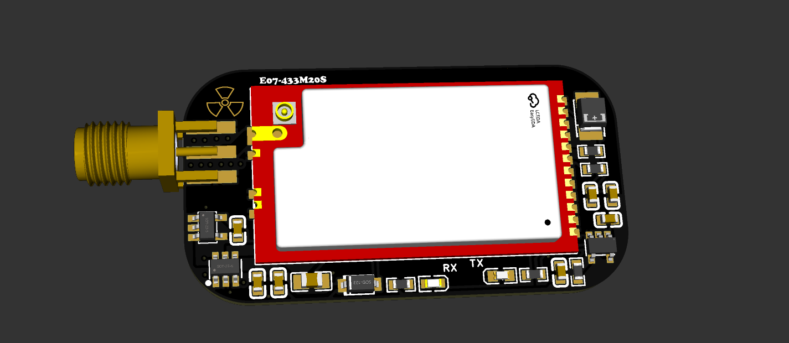

# Flipper-Zero-Flux-Capacitor — CC1101 Module for Flipper Zero
Open source Flux Capacitor PCB for Flipper Zero using E07-433M20S (CC1101). Sub-GHz module. ⚡

---

> **Don't be left in the past.** The most powerful external CC1101 module for the Flipper Zero — now working natively.


---

## 📸 Preview


| Schematic | [View PDF](schematic/SCH_flipper-flux-capacitor.pdf) |
---

## 📖 What Is It?

The **Flux Capacitor** is a 5V-powered, external CC1101 module designed specifically for the Flipper Zero. Built on the **E07-433M20S chipset**, it delivers up to **100mW of output power**, letting you receive and transmit signals in the **425–450 MHz** range like never before.

---

## ⚠️ Important — Antenna Required

> **IT IS MANDATORY TO USE AN ANTENNA WITH THIS MODULE.**
>
> Operating this module without a proper antenna can cause **irreversible damage**. Damage resulting from antenna-less operation is considered user error and is **not covered** for replacement or repair.

---

## 🗂️ Repository Contents

```
/
├── gerbers/          # Gerber files ready for PCB fabrication
├── schematic/        # Schematic PDF
├── bom/              # Bill of Materials
├── pics/             # 3D renders / board photos
└── pickandplace/     # pickandplace files ready for PCB fabrication
```

---

## 🏭 Manufacturing

To order PCBs, use the files in the `/gerbers/` folder. They are compatible with most PCB fabrication services (JLCPCB, PCBWay, OSHPark, etc.).

Refer to the BOM in `/bom/` for component sourcing.

---

## 🔧 Getting Started

1. Connect the Flux Capacitor to your Flipper Zero's GPIO header
2. Attach the included 433 MHz antenna to the SMA connector
3. Power the module via the 5V GPIO pin
4. Use the native Flipper Zero Sub-GHz app — the module is detected automatically

> **Never power on without the antenna attached.**

---

## ⚖️ Legal Disclaimer

The **Flux Capacitor** is intended solely for **educational, research, and personal use**.

We are not responsible for any unauthorized or illegal use of this product. It is the **user's sole responsibility** to ensure that all transmissions occur only on permitted frequencies and within the power limits allowed by their local jurisdiction and applicable regulations.

By using this product, you agree to hold harmless the designers and any associates from any and all loss, damage, claims, or liability arising from your use of this product.

> **Always transmit legally. Know your local RF regulations.**

---

*Made with ❤️.*
